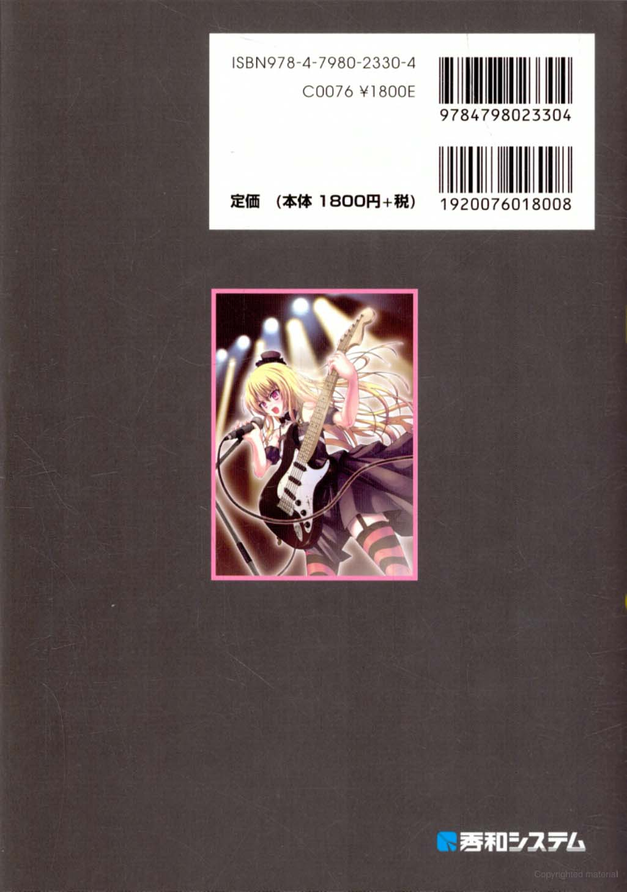






原作：[女の子の声になろう！](https://www.shuwasystem.co.jp/book/9784798023304.html)\
ISBN：978-4-7980-2330-4 C0076\
作者：[七ノ瀬](https://www.shuwasystem.co.jp/author/a181950.html)\
插图：べたにゃ\
出版：[秀和システム](https://www.shuwasystem.co.jp)\
翻译：[佐倉 奈緒](https://www.zhihu.com/people/sakuranao)\
Google Book：<https://books.google.com/books?id=q_vYXUukqr0C>

> 译者的话：
>
> 这是一本结合了 插画、音频 和 基础训练手段 的 伪声训练书籍，同时也有让声音变得更好听的效果。
>
> 请控制好每天的练习时间，在出现不适时及时停止练习。
>
> 本书的部分练习项目需要有日语最基础的  基础，译者将会使用  和  两种手段帮助大家进行练习。
>
> 祝愿大家能够获得所期望的声音！

本项目基于 <https://www.zhihu.com/column/weisheng> 重新整理

## 注意事项

1. 本书是作者以独自进行调查的结果进行出版的书。
1. 本书的内容是以万全的计划进行制作的，万一出现可疑的错误或记载错误的情况出现，请以书面形式和出版社联络。
1. 关于使用了本书的内容而造成的影响，请自行承担。
1. 关于本书的内容，将来有不进行预告而进行变更的可能性。
1. 本书所记载的公司名、产品名，是各公司的注册商标或商标。
1. 本书的一部分或全部，在没有得到出版方的文书许可下进行复制是禁止的行为。

跟随着本书的练习，祝各位都能够接近理想的声音。

## 本书的使用方法

本书是对为了学习接近女性的声音，对声音、言语和表现进行训练的附带 CD 的书籍。\
为了获得接近女性的声音，有效的课程、发声的要领、无法发出声音时候的对策等等在文中随处可见。\
即使说到接近女性的声音，也有着各种各样的类型，并不能概括性的讲“这个方法就是全部”。\
但是，根据本书所提示的方法进行配合性的练习，可以着实地朝着所期望的声音靠近，成功率可以得到大幅的提高是没有错的。\
同时本书并不仅仅限于学习接近女性的声音，对于单纯的想要获得好听的声音的人来说，也是十分有所帮助的练习，请务必进行尝试。\
附带的 CD 中，收录了锻炼本声和假声的训练内容音轨。\
在本书中出现【音轨 X】的时候，请同时听取其内容，然后继续进行练习。\
跟随着本书的练习，祝各位都能够接近理想的声音。

---

原文：

- 成为女孩子的声音！【0】目录及注意事项\
  <https://zhuanlan.zhihu.com/p/45974316>
- 成为女孩子的声音！【28.5】目录及注意事项\
  <https://zhuanlan.zhihu.com/p/48247815>
