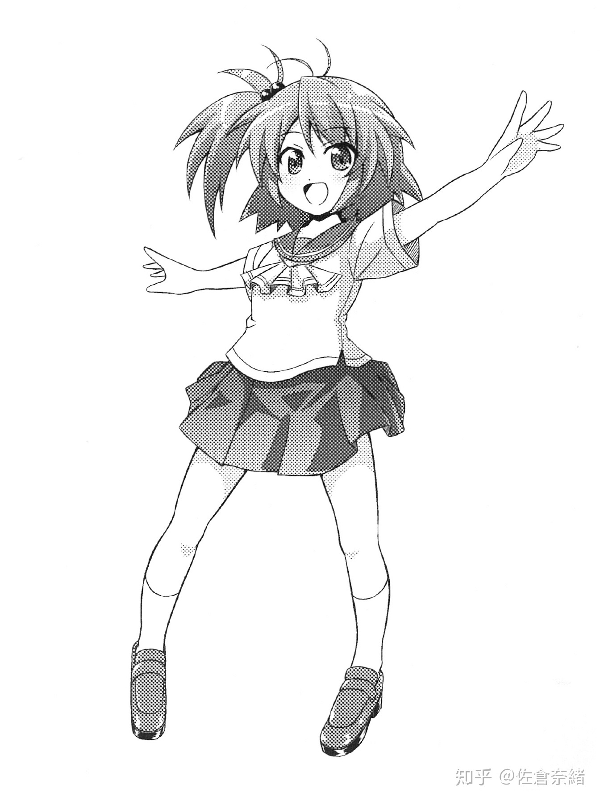
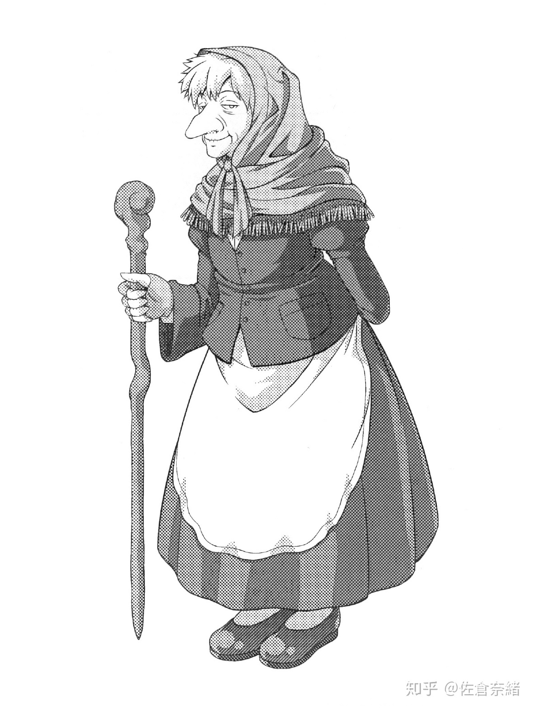
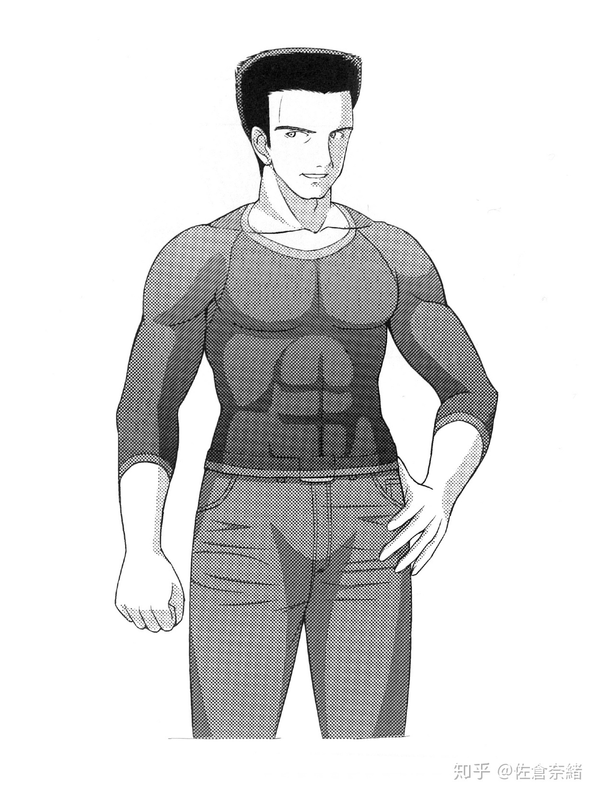

最初首先要进行的并不是女声的练习，首先先停止在对本音和假声的练习上。如果不打下良好的基础的话，可以确信歌声也只是崩坏了一样。
虽然最初就开始女声练习的人能更早的学会女声本身，但是会带上你原来的歌声中的不好的癖好，其完成度和最终的练习效率和遵循步骤相比有着天壤之别。
不要着急，慢慢地踏实地做下去才是最好的进步方法。

## 每天的练习时间 {#practice-time}

每天合适的练习时间，在最初的一个月的时间为 20 分钟。

---

从第二个月开始每天的练习时间为 30 分钟，本书是这样制定的。请注意不要过多练习。

最初的一个月每天给你自己 20 分钟的练习时间吧。这 20 分钟，是不可以保存下来的。
请不要“因为昨天没有练习，今天就练习 40 分钟吧！”。已经失去的时间是没法取回的。

20 分钟的时间从“[（阶段 1）锻炼本音][stage-1]”到“[（阶段 2）锻炼假声][stage-2]”的练习，时间的分配交给你自己进行。

让本音的锻炼尽早结束，立刻就移动到假声的练习是不好的。
但是，完全不练习的话也不好。
还有，经过最初的一个月之后假声还不能自由发出的人请不要进入到接下来的“[（阶段 2）锻炼假声][stage-2]”的步骤。

---

从第二个月开始，每天给你自己 30 分钟的练习时间吧。

对于哪种练习来说分配怎样的时间都没有关系。如果你觉得自己的练习还不足够的话，
仅仅是本音的锻炼就消费全部的 30 分钟也没有关系，重点性地进行假声的练习也没有关系。
但是，在重点地进行更加靠上阶段的练习的时候，请务必完成下面阶段的练习。

因为本音的练习仅仅只有 [阶段 1][stage-1]，虽然 30 分全部用掉也没有关系，
但因为假声的练习在 [阶段 2][stage-2]，重点锻炼假声的情况下也请分配一部分时间给下面的 [阶段 1][stage-1]。

---

[阶段 0][stage-0] 不在其中。

你现在的等级，就是阶段的数字。
请不要过分地相信自己的实力，但这样说的话也不要过低地评价自己。正确的计量自己的实力也是一种实力。

“[（阶段 0）听一些歌吧][stage-0]”并没有时间的限制。
在嗓子休息的时候作为练习也是一种不错的选择。

## 练习清单的制作方法 {#checklist}

想要制作发出女声的连续清单，因为在不了解自己现在的实力，不擅长的事情的情况下，不知道该以什么为重点进行练习。怎么做的话更好呢。

即使是说自由地制作自己的练习清单，对于不知道该怎么做的，不清楚自己处于哪一个阶段的人，下面将会提示一些目标。

---

**【嗓音训练什么的是第一次！】**

**【我觉得自己还差得远呢】**

**【经常被人说是音痴】**

> → 在第一周仅仅进行 [阶段 1][stage-1]。
> 从第二周开始，如果假声能够发出来的话请将 7/10 的时间分配给 [阶段 2][stage-2]。
> 如果发不出假声的话，请参考下面的【发不出假声】。

---

**【发不出假声】**

> → 以 [阶段 1][stage-1] 为主，仅仅在每天练习的最后 5 分钟的时候尝试着进行发出假声的练习吧。
> 如果变得能够完全发出假声的话，找到声音的音阶和强弱进入到假声的应用练习中吧。

---

**【擅长假声！想发出的时候就能发出】**

**【在本音和假声转换的时候一下子就转换过去了】**

> → 以均等的时间练习 [阶段 1][stage-1]，[阶段 2][stage-2]，[阶段 3][stage-3]。
> 如果有 30 分钟的话应该就可以足够进行了吧。

---

**【虽然很擅长假声但是本音还差一点】**

> → [阶段 1][stage-1] 进行 20 分钟，[阶段 2][stage-2] 进行 10 分钟。

---

**【假声已经相当完美了！和发出本音的时候几乎是同样的精度】**

> → [阶段 1][stage-1]、[阶段 2][stage-2] 各 5 分钟，
> [阶段 3][stage-3]、[阶段 4][stage-4] 各 10 分钟。

---

**【从本音的最低音到假声的最高音之间能没有违和感地连接】**

> → [阶段 1][stage-1]、[阶段 2][stage-2]、[阶段 3][stage-3] 合计 7 分钟。
> 剩下的时间请分配给 [阶段 4][stage-4]。

---

**【歌声相当棒。只是想发出女声】**

> → [阶段 1][stage-1]、[阶段 2][stage-2]、[阶段 3][stage-3] 合计 15 分钟。
> [阶段 4][stage-4] 进行 15 分钟。
> 这个时候，喉咙稍稍感到违和感的话也请中止练习。不推荐这样进行。

---

**【完成度差不多，想尽快学会】**

> → [阶段 1][stage-1]、[阶段 2][stage-2]、[阶段 3][stage-3]、[阶段 4][stage-4] 的时间平均分配。最初的一个月请将重点放在阶段的前半。

---

**【本音、假声、混声都很不错】**

**【之前就有进行过嗓音训练，专业级的技能】、**

> → 请自由练习。这个水平的话，和女声不相关的发声技术的学习应该用不了多久。

---

[stage-0]: {}
[stage-1]: {}
[stage-2]: {}
[stage-3]: {}
[stage-4]: {}

## 锻炼本音 {#original-voice}









## （阶段 0）听一些歌吧 {#stage-0}

首先，对练习的第 0 阶段进行介绍。因为是基本中的基本，但是虽然是基本但是是非常重要的事情。这就是“听歌”的事情。

怎么样。是不是觉得很简单？只是听歌，仅仅的这件事。

虽然你可能会觉得“听歌什么的我每天都有在听啊！”，请先不要跳过这一段。这么做是有原因的。

你在平常听歌的时候，有对歌声进行分析吗？歌手有着怎样的声音表现？怎样运用着技巧？换气的位置在哪里？这个时候的换气是无声的，还是很明显的？
音量的控制和声音的洪亮程度呢？抑或是句尾的处理呢？向假声转换的转换点呢？……你有没有认真听到这种程度呢。是不是仅仅是听而已呢。

接下来，让我们把关注点放到歌手的歌唱方法上吧。如果对耳朵进行锻炼的话，仅仅是听很短的声音也可以在某种程度上了解那个人的本音和假声的练习程度和混合程度，
喉咙和声带的闭紧程度和声音的发出方法。首先我们要做到的是能够对自己的声音进行分析。这样的话，自己的发声方法的哪里不够好，对哪里进行改变的话能更接近理想的声音，
自己就能对其做出判断。这是为了更快的进步打造出的近道请务必利用一下。

这个练习的话，可以在去公司的电车上、在电脑旁上网的时候、在咖啡店享受咖啡的时候进行。但是，为了避免听力下降请不要长时间使用耳机，音量也请经常注意。

同时，因为对于这个练习来说比起扬声器来说头戴式耳机在特性上更有利，所以在这里推荐使用头戴式耳机。
如果是头戴式耳机的话虽然用什么都可以，个人来说推荐索尼 SONY 的 MDR-CD900ST。

> 编辑注：，
> Sony MDR-CD900ST（上市于 1989 年） 的下一代产品为 Sony MDR-M1ST（上市于 2019 年）
>
> 您可以在 [监听耳机的选购](https://github.com/mtf-wiki/jyosei-guide/discussions/2) 做进一步的讨论



这个头戴式耳机因为是监听用途的耳机，比起享受音乐来说能够听取到更正确的声音。录音演播厅和电视台等首先看到的就是这个耳机。
头戴式耳机爱好者一定会给予好评且拥有的头戴式耳机。当然这也是我有的头戴式耳机。虽然这段的后半没有什么关系。但是，拥有的话不会有任何坏处哦！

在这里你应该会对一些事情有所注意了吧。在歌声中有各种各样的颤音。本音和假声，和不属于两者的声音。

CD 的声音，对各声音的特征都容易捕捉，比起理想的状态来说发声的方法有点过头。注意到了吗?



## （阶段 1）锻炼本音 {#stage-1}

对于普通人来说，仅仅只能发出日常生活所需要的最低限度的声音。即使有在学校练习歌唱的机会，也只是在高中的时候吧。
因为现在的身体仅仅只能发出所需要最低限度的声音，首先从“本音”开始吧。

你在平时的生活中使用着你的肌肉。换衣服的时候，端碗的时候，拿筷子的时候，刷牙的时候，拿包的时候，转动门把手的时候……。在各种的情况下使用着手腕的肌肉。

但是，你的手腕并不像专门的武斗家那样的手腕。腹肌也是如此。你在坐起来的时候，笑的时候，用力的时候，你就在无意识的情况下使用着腹部的力气。
但是，你的腹部是不会自然地分成块状的。除了进行特别的锻炼之外，经过多少年都不会分成块状。

那么，你平常的话使用着本音说话。发出着声音的时候。和朋友聊天的时候，向公司的前辈打招呼的时候，通过电话和恋人甜蜜地对话……。这些时候应该都使用的是日常的声音吧。

但是，这样只能说是发出声音。绝对不是锻炼的行为。所以，想要发出好听的声音必须通过特别的嗓音训练来锻炼自己的声音。

在你想要锻炼你的腹肌的时候，你会在床上重复抬起你的上身。这又是为什么呢？是为了更有效率地进行锻炼。而这样的训练并不是做个一两次就可以的。
比起做个一两次来说，这样的动作连续进行 30 分钟是更有效率的。

因此，你必须先从作为练习最合适的本音的练习开始。这样是因为这样锻炼的话更有效率。

如果以不怎么完美的声音继续练习的话，等同于只做个一两次，经过多久也不会出效果。这也就不能说是练习了呢。

对于本音的练习，基本上以“啊——”的发音进行，

**发出本音吧**

首先请先发出 CD 中【音轨 4】一样的本音。



使用你正常说话时使用的声音发出“啊——”吧。容易发出的较低的声音，三秒左右就可以了。

即使是说本音，在这个状态下也有各种各样的发声。比如关紧喉咙的。让气息更多露出的，过于抬升喉结的。嘴过于张开的。发音变得很暧昧的……。

在这里首先先去掉这些负面的要素，作出理想的本音。以这样的声音练习的话，和普通以本音练习的时候练习成果有着很大的差别。

一开始的时候，先不要考虑一些较难的事情仅仅对 CD 的声音进行模仿也是没关系的。为了能让声带机能性的活动我们要让哪里哪里的肌肉活动哦！
虽然即使是这样说也肯定做不到，通过声音的模仿却可以来让那个位置的肌肉间接性地活动。真是太棒了！

掌握了【[阶段 0.听一些歌吧][stage-0]】的话，便可以听出来理想的声音所特有的音色。

如果能够这样听的话，以你自己的声音，和理想的嗓子的状态，便可以作出练习效率优良且独特的声音。

**找到音阶发出本音**

模仿着 CD 的声音，尝试着发出各种各样音阶的声音吧。这个时候，用力大喊是不行的。以不要让声音极端小的低音开始，不要达到用力大喊的程度发出高音，发出各种阶段的声音吧。

**锻炼假声**

## （阶段 2）锻炼假声 {#stage-2}

锻炼了本音之后，接下来是“假声”。多数的男性，可能会有“我可发不出假声啊”这样的挫折。但是，完全没有放弃的必要哦！



实际上，假声和女声之间并没有直接的关系。因为女性并不是常常使用假声说话呢。大多数的人，和男性一样以本音在讲话。
但是，直接上没有关系的东西，男性发出女声上有间接的，深刻伴随着的关系。并不仅仅是有着直接关系的东西会触碰到事情的根源。
假声，是发出女声之上最最重要的要素。至少，从能够自信地说出“想要发出女声首先就不能失败”一样能够自由地发出假声之后再进入下一步。
对于最初没法发出假声的人来说，因为还没有习惯发出假声，请绝对不要练习超过 20 分钟。
如果感觉嗓子疼痛或者假声断断续续沙哑的情况下，在这个时间点即刻中止练习，知道嗓子的违和感消失为止进行足够的休息再重新开始练习。

假声的练习，请基本上以“哈——”或“hō——”的发音进行。

**尝试发出假声**

那么首先，尝试着发出假声吧。在这里因人不同可能会有人没法完成。对于发不出假声的人来说，仔细听 CD 里的示范并模仿，发出自己最容易的高度就可以了，变得能发出来吧。

**发出假声的方法**

```quote
模仿舞台剧歌手的声音，不要用力渐渐向高。
模仿猫头鹰的叫声“hō——”
以哼唱的感觉发出高音。
发出情绪高涨时候的声音。“呀啊吼噢噢噢噢！”
将叹气声以高音发出。
```

对于发不出假声的人来说，想发声的时候的不经意间将“好，这次一定要成功！”这样的气势带入其中，这样的气势变成了用的力气，反而会成为发出假声的阻碍。
假声的基本，不，发声的基本是去掉所有的力气。像“哈~”叹气的时候控制好力度吧。

即使是好不容易发出来的话，先不要在一开始就着急进入到应用练习中，请仅仅在这里进行练习发出假声的练习。

**找到音阶发出假声**

能发出假声了吗。最初就能够发出的人，请从这一步开始练习。

那么假声也和本音一样，尝试着发出各种各样音阶的声音吧。伴随着接近最高音和最低音，声音应当会变弱且不稳定。
这个时候不要勉强自己，音量多少下降一点也没有关系，请一定要注意不要过于提高自己的音量。

**锻炼假声的发音吧**

在没有习惯假声的时候发声的话，发音就只是会变得暧昧。这也是，即使是最初开始就有所使用假声的人抱有的烦恼。
即使可以在节奏慢的曲子中全部以假声歌唱，到了节奏快的曲子会变得怎么样也就不用说了……。

即使是平时使用的本音有时也会发声这样的情况，更不用说是平时不使用的假声了。

**锻炼流畅发音的练习法**

```quote
アエイウエオアオ　カケキクケコカコ
サセシスセソサソ　タテチツテトタト
ナネニヌネノナノ　ハヘヒフヘホハホ
マメミムメモマモ　ヤエイユエヨヤヨ
ラレリルレロラロ　ワエイウエオワオ
```

（以上内容请对照日语  进行）

以清楚的发音，注意让嘴不要张得太大的情况下大声朗读吧。

**给声音的大小找到强弱吧**

首先，找到气息变化到声音的瞬间的，不在安静的地方就没法听到的声音小声地发出假声吧。

细微调整构成假声的肌肉应该是相当困难的。现在，尝试着从这样的声音连接到大声的假声吧。

这个时候音高可能会发生变化。

发出了不到喊叫的程度的假声之后，现在从这样的声音连接到像蚊子一样小声的假声吧。重复以上步骤进行。

**尝试以假声发出 10 秒以上的长音吧**

这个练习，请特别地以“呜”的发音进行。这是为了不让假声的气息漏出的练习。自己容易发出的音高就可以，连续发出 10 秒以上的假声吧。
注意声量不要过小的情况下多大的声音都没有关系。能够简单做到的话，发出自己比较难以发出的，最低音和最高音附近的音，或者伴随旋律提高难易度吧。

**这次刚好相反，尝试着发出 3 秒都没法保持的假声吧**

气息的漏出很少或者很多，如果这两种都可以做到的话就可以说是可以调节了。

首先，将气息以“哈~”吐出。这个时候不发出声音。仅仅是吐气时候的“哈~”。只是将“哈~”这个气息的音量放大吧。
同样的要领，这次在让声音叠加上这个气息吧。技巧是，并不是试图去发出漏气较多的假声，而是将声音叠加上去的感觉。

漏气的声音会成为女声的关键，认真在这里练习吧。气息长时间漏出的话可能会变成缺氧状态。这个时候进行深呼吸，重整气息吧。

**从漏气较多的假声，移动到漏气较少的假声吧**

最初发出 5 秒左右漏气程度较少的假声。保持这样的气息，渐渐的让漏气量增多吧。这个时候的发音，也从“呜”顺滑地连接上“哈”吧。

做到这些的话，声带的练习就已经做得相当好了。重复多次练习之后，就可以进入到下一个阶段了。



**习得女声**

## （阶段 3）让本音和假声顺畅地连接 {#stage-3}

那么，从这里开始就是稍微高级一点的“混声”的练习了。只要是确实地进行了本音和假声的练习的人，仅仅需要的只是抓住技巧。
能够实际感受到练习的成果的，也是从这个阶段开始。

即使是能够单独使用本音和假声的话，如果不能将他们毫无违和感的衔接在一起的话就并没有什么意义了。
在唱歌的时候，在本音到假声之间的转换点让声音反转，让声色一下子转换……。和女声的时候一样。

一般来说，男性和女性相比能发出声音的范围有所不同。虽然也有例外，多数的情况下女性能够比男性发出更高的声音，相反男性可以发出比女性更低的声音。
紧接着，随着男性能够使用假声之后，在某种程度上声域（能够发出的声音范围）能够覆盖女性的声域。但是如果，本音和假声没有办法连接的话……?

虽然在这里问不是很合适，但是你应该没法以女声歌唱吧。因为能够发出的声音范围还是男性的声音范围……。如果使用假声发出女声的话，便没法发出低音的部分。
如果使用本音发出女声的话，便没法发出高音的部分。这样的话，也就没法唱歌了呢。在这个阶段，为了将这个问题解决，让我们学习混声吧。

**交叉发出本音和假声**

首先发出本音，紧接着请发出假声。怎么样，因为先发出本音，假声是不是被绊在了喉咙的深处？声音有没有一下子对换的感觉？

那么这次，先发出假声，紧接着再发出本音吧。是不是没有问题地发出了呢。

**从本音顺滑地移动到假声**

这是作出混声的练习。一口气，从本音顺滑地连接到假声吧。这个时候，为了让转换点不那么明显，还需要很多的练习。



**从假声顺滑地移动到本音**

也有更容易做到这一个练习的人。从本音到假声，假声到本音顺滑地来回移动吧。

## （阶段 4）学会女声吧 {#stage-4}

终于到了本书的正题，现在开始进入到“女声”的领域。虽然不会成为一般的练习，但请和直到 阶段 3 为止的练习平行进行吧。



从现在开始，让我们进入到为了习得女声的练习当中吧。虽然 阶段 1 到 阶段 3 之间可以作为普通的嗓音训练使用，因为在这个阶段是专门为女声特化的内容，
并没有提升歌唱能力的益处。同时，仅仅在这个阶段中，因为为了能得到理想的发声，因此包含着不适合普通练习的方法。
像开头说的一样，女声对于男性的你来说并不是自然的发声方法。这件事请你务必理解，

现在开始请忘掉到现在教给你的发声时的方法和知识。伴随着情况不同也有不得不需要用力的时候，脸稍稍向上会成为靠近女声的目的达成的近道。
但是，在这里请特别注意喉咙的健康。请在这里和我约好，即使稍微感觉到了违和感，立刻中止练习并取得休息哦。

**作为第一材料的“漏气”驱使下的假声的女声**

这里是 阶段 2【尝试着发出 3 秒都没法保持的假声吧】的应用篇。如果能够完全掌握 阶段 2 的话，也就不用费力操作漏气声了。
可以说这个声音是本书中作出女声的材料之一，仅仅是这样做的话也有能听出是女声的事情，也可以十分期待作为女声成立的精度。
发出女生的方法虽然有很多种，请把这个方法作为其中之一确定的方法。这个方法必须要以足够锻炼过的假声作为前提。
如果，没办法很好地进行下去的话先回到 阶段 2 也是很有效的。

首先先用普通的假声发出“哈”的发音吧。在这里逐渐变高，让声音的漏气逐渐变多。并不是一开始就发出女声的感觉。一点一点地接近女声。
希望你能够记住这样变化的过程。

接着，请意识到喉结的位置。随着变化的过程，喉结的位置应该也会有所变化吧。在发出女声之上，抬高喉结这件事并不是一件坏事。

如果听起来有点像女声的话，保持着现在的声音逐渐减少声音的漏气。技巧是，仅仅在发出声音的开头让气息漏出。
并不是全体性的让气息漏出，仅仅让发出声音的一部分的声音漏出，控制住气体的消耗。

在这个练习中，因为要让喉咙张开，并且是在不用力的状态下，首先就不会出现让喉咙疼痛的事情发生。
如果喉咙疼痛的话，有可能是假声的发声法搞错了的原因。在喉咙的疼痛消失后，在从 阶段 2 重新开始吧。

其他的，如果变成较高的尖锐的声音的话便是过于用力的原因。这样的声音想要转化成女声是不可能的，所以有改善的必要性。

这里的女声因为需要 阶段 2 作为重要的钥匙，不怎么顺利的情况下请复习 阶段 2 吧。

**作为第二材料的“Vocal Fry”驱使下的本音的女声**

保持上提喉结的同时发出本音。为了确认，也可以把手放在喉结的位置的同时发声。不知道怎么上提喉结的人，请参考以下的方法

**喉结的上提方法**

```quote
咽口水
发出假声
```

保持发出假声时嗓子的状态发出本音，这样也是最简单的一个方法。怎么样，有没有变得比较平常一样的声音了？

接下来保持着嗓子的状态，加入清嗓子时候的感觉。形成比较痛苦且刺耳的声音的话便是成功了。保持着这样的声音，更加抬高喉结的位置吧。

通常，在 [下图（图 04）]() 位置的喉结，请将喉结抬升到能够完全被下颚埋没的高度。



因为这个时候大体上已经是用力的状态了，保持着喉结的位置，让刺耳的声音逐渐消失的操作肌肉。因为肌肉的微调整是关键，这也是让大家熟练各个阶段的原因。

**建立女声的基础**

那么，现在材料都已经准备好了。让第一材料和第二材料相混合来作出作为女声基础的声音吧。先把这样的方法命名为“ハイブリッド法”吧。

核心的部分使用第二的材料。以消除刺耳感的状态发出声音吧。接着第一的材料作为表面，让少量的气息漏出。也可以把发出声音第一的材料和第二的材料紧接这样理解。

是否听起来像女声，如果身边有能够实时在身旁进行判断的人的话，务必请他进行协力。

给声音带上感觉的话进行练习的时候相对更为有效。在以前，专门上有叫做アンザッツ的方法，“声音向各种声音上面尝试”的方法也正是这个原因。



**作出理想型的女声吧**

伴随着无聊的练习的积累，有没有感觉到一些什么了呢？那么，包含着试探成果的意义，在这里尝试着发出喜欢的角色的声音吧。

即使是说女声的话，也是有各种各样的类型的。特别是从毫无特征的女声到幼女一样的声音、阿姨一样的声音、活泼的运动少女的声音、色气的大姐姐的声音、
消逝短暂的女孩子的声音、帅气的女孩子的声音、淑雅感觉的声音、大小姐一样的声音……。还有，少年一样的声音在这里也包含在女声的类型当中。
作为女声基础的声音已经作好了吧。那么，尝试着作出自己理想型的女声吧。

请想象自己想要发出的声音和正以这个声音讲话的角色。声优正是你。将你的声音，转移到这个角色身上。

使用现有的角色或者自己创造出来的原创的角色都可以，实际存在的人也没有关系。请创造出以你理想的声音讲话的角色。

这是为了能够发出自然的女声所不可欠缺的重要的练习。结束这个练习的时候，你应该就能获得理想的女声了吧。

为了难以进行想象的人，在这里准备了 6 种类型的角色。请以成为声优的感觉，演绎接下来的角色。





```quote
ねえねえねえねえ、いっちょにうたおうょ。
わたしカルピス頼むけど……なにかいる？
その曲すっごくいいね。なんて曲？なんて曲？
あっあれ？入れる曲間違えちゃった……

呐呐呐，一起唱歌嘛。
我点了可尔必斯……要点什么吗？
那首歌真的很不错呢。哪首歌？哪首歌？
欸欸？点的歌弄错了……
```





```quote
へえ、点数だけは高いんだ。でも逆に惨めだよね。
ごっめーん。手が滑って、演奏中止押しちゃった。
ふーん。マイク、そのまま私に渡すんだ。へー。
私今から寝るから、ちょっと黙っててくれる？

欸，只有分数很高呢。但是反过来来说也很惨呢。
不好意思。手滑啦，点到了演奏中止的按钮了。
嗯。麦克风，就这样递给我呀。誒——。
现在我要去睡觉了，你能不能安静一点呢？
```





```quote
アーアー、ただいまマイクと私の美声の調整中。
へぇ～結構歌うまいんだ。ちょっと意外かも。
お姉さんとデュエットしない？恥ずかしい？
ほらほら、もうはじまってるよ。さあどうぞっ。

啊啊，现在我正在调整麦克风和我的美声
欸~歌唱的挺好的呢。挺意外的呢。
和姐姐一起二重唱吗？害羞啦？
已经开始了哟。来吧来吧。
```






```quote
オレンジジュースとかっこいいお兄さんください。
じゃーん、マイマイク。しかもスタンドつき～
ついにみせるときがきたか……。いいだろう。
ふふっ、ほんきだせばまあざっとこんなもんよ。

请给我橙汁和帅气的小哥哥。
锵锵，麦克风麦克风。而且还附带着支架~
终于到了表演的时候了……。挺好的呢。
嘿嘿，认真的水平就是这样的哦。
```






```quote
演歌だと思ったかい。あたしゃメタラーだよ。
ヘビーじゃなくてへヴィ！死にたいのかい！
相棒のメタル·モンスターに乗っかってエメラルドソードを探しに行った若い頃を思い出すのう。

你以为这是演歌吗。这可是摇滚噢。
我才不重呢 可恶！想死吗！
这让我想起了我坐在金属怪物上寻找祖母绿剑的年轻时光。
```





```quote
ちっちがうんだ。
マイクに口を近づけてうたっているのは
近接効果やブレスの表現等の特殊効果を狙ったわけであり、
けっして声が小さいからとかそんなんじゃないんだ。
本当だぞっ。そんな目でみるなよっ。

不，不是这样的。
把麦克风凑近嘴歌唱是因为瞄准了
接近效果和呼吸表达等的特殊效果，
绝对不是因为声音太小什么的。
真的哦。别用哪种眼光看着我呀。
```






```quote
なかなか良い声出すじゃねえか……気に入ったぜ。
ところで俺の音量だが、こいつをどう思う？
次はお前の番だぜ。ほらよ、受け取りな。
俺はオレンジジュースなんて頼んだ覚えはない。

这不是发出了挺好的声音了么……要认真了啊。
顺便一提我的音量，怎么样？
接下来就是你了。嘿，拿着它。
我可不记得我点了橙汁。
```




## 熟练使用颤音吧 {#use-trill}



关于颤音，虽然在这个阶段没有记住的必要，对于感受到实际效果和维持自己的动力也是有效果的。在这里作为参考进行解说吧。

跳过这一阶段也没有关系。但不如说，请在最初的时候跳过这一段。过去有名的莫扎特的父亲曾把颤音叫做“自然教给人间的东西”。
就像这样，颤音是使用放松状态良好的发声法就可以自然记住的技巧。但是，即使满足条件也有没法发出的情况，和进行颤音的练习反而可以学到放松了的发声法，因此，设置了这个阶段。

颤音，说的是让音周期性颤动的事情。通过这个，能更将声音传达到观众的心里。

说一个这样的故事吧。之前有个时候，我接到了一通电话。电话的对方，向我说了这样一句话。

> “能教我颤音吗”

我听了那个人的声音之后，这样回答了。

> “如果想要让自己的歌声更好听的话，学习颤音还太早。你只是单纯的想要学习颤音，还是说想要歌唱的更好听，才想学习颤音的呢。
> 单纯想要学会颤音的话立刻就可以教你。如果你想歌唱得更好听的话，为了你好我不会教你。这是因为你还没有达到这个阶段。作为代替，在这一小段时间里和我一起进行嗓音训练吧”

他很快地就答应了。

接着，在进行了 3 次嗓音训练之后，我交给了他颤音。接着没想到的是，他用了不到 1 分钟就学会了颤音，变得能够使用了！（比我还快……）

在学习颤音之前，简单的在这里记载上良好的颤音的条件。

良好的颤音的条件：

1. 心情良好
1. 声音的感觉良好

以上。很简单吧。如果说到难的部分的话，颤动的周期就是每秒 6 次了，虽然这么说了，但因为种类的不同和需要特殊效果的场景，需要记住的仅仅是这个条件就足够了。






跟随 CD 说“wow”吧【音轨 09】

接着是“wow wow”

紧接着“wow wow wow……”请增加发音的数量。

接着，逐渐加快速度。

找到了“wow wow”的感觉的话，同样以“欧”的发音进行。

这次变化到“啊”的发音进行吧。




轻轻的用大拇指和食指顶住喉结，然后发出“啊——”的声音。这个时候，轻轻地让手指上下运动。记住以呜哇呜哇有起伏感觉的音吧。

对于颤音的练习，让自己的声音便得能够回声的状态便是一种技巧。




## 以超高音发出哨音 {#whistle-voice}



在这里，对极端的高音进行练习。虽然对于用处还是十分微妙的，但是挑战高音的事情是十分有益的。

哨音（whistle voice）。相信这应该是大家不常听过的词。如同哨音的名字，拥有着哨子一样的声响，这个声音可以发出比假声更高的声音。

发音方法比其他的来说相对特殊，声音发出的原理和其他声音相比也有着很大的差异。但是，请不要担心。难易度本身来说并没有那么高。只是发出的声音很高而已呢。

和其他的发声法相同，基础建立好的话就可以立刻做到。哨音的情况下，和嗓子和声带的自由开闭的习得也是一样的。说到需要注意的事情的话，关闭嗓子和关闭声带是两种情况。

发出哨音的方法

将喉的位置固定在发出假声最高音时候的位置。

以这个状态，轻轻地呼吸。应该会发出弱弱的声音。如果发出闭紧嗓子一样的声音的话有可能是闭紧嗓子想要发出高音的状态。进行改善吧。

以打开嗓子的状态发出高音，发出弱弱的声音之后闭合声带。保持着嗓子打开，关闭声带。作为感觉上的话只要感觉到嗓子的下方闭紧的话就可以了。

这个时候，让仿佛是吹口哨一样的呼出的气体通过。

“bi——”的，发出像吹口琴一样感觉高音的话就是成功了。

## 相反发出像男性的声音 {#male-voice}



熟悉了自己的女声的话，反而会出现担心自己就成为女声的事情了。这时候反而进行“男声”的练习的话，享受这时候的反转吧。顺利的话，可以演绎出女声和男声的对话哦。

对于想要发出女声的大家。这里要不要稍微放松一点学习像男性的声音呢？

对于有“好不容易练习了女声，练习像男性的声音不就会回到原来的声音了么”这样想法的人请放心。并不会发生这样的情况。
不如说，让各发声器官的使用更加的流畅，也会给习得女声带来加分的作用。
因为是男性，所以比起女声的话这样的声音更加简单，务必尝试着练习一下。能够发出像男性的声音才会映射出女声哦。




以“gooooo”这样，请发出让喉咙深处鸣响的低沉的钝感的声音。接着保持着嗓子的形状，一下子让嗓子解放发出声音。

男声的基本是让喉结下降。如果变成演剧歌手那样的音色的话，不仅仅需要让喉结下降，还需要让声音从嗓子的更深处发出。
和歌剧声的不同是，不让喉结过于往下和，声带稍稍过于闭紧。




在这里向全身用力。用力的话，就没有办法呼吸了。之后用力缓和的话就终于可以呼吸了。像这样的状态一样用力。

接下来，保持着嗓子周围的用力，让全身其他部位放松。接着，维持着这个状态发出声音。发出了较粗的声音了话，保持着这样的音色逐渐从嗓子的部位将力气撤出。




模仿僵尸的呻吟声。保持着这样嗓子的形状尝试着说话吧。以成为将使得感觉，像呻吟一样的声音说话。

发出男声的场合，请以从嗓子深处发出声音的感觉进行。






---

原文：

- 成为女孩子的声音！【35】练习时间和练习清单\
  <https://zhuanlan.zhihu.com/p/48857840>
- 成为女孩子的声音！【36】锻炼本音\
  <https://zhuanlan.zhihu.com/p/48965056>
- 成为女孩子的声音！【37】锻炼假声\
  <https://zhuanlan.zhihu.com/p/49085079>
- 成为女孩子的声音！【38】习得女声\
  <https://zhuanlan.zhihu.com/p/49167747>
- 成为女孩子的声音！【39】作出理想型的女声吧\
  <https://zhuanlan.zhihu.com/p/49298724>
- 成为女孩子的声音！【40】颤音、超高音、男声\
  <https://zhuanlan.zhihu.com/p/49476025>
